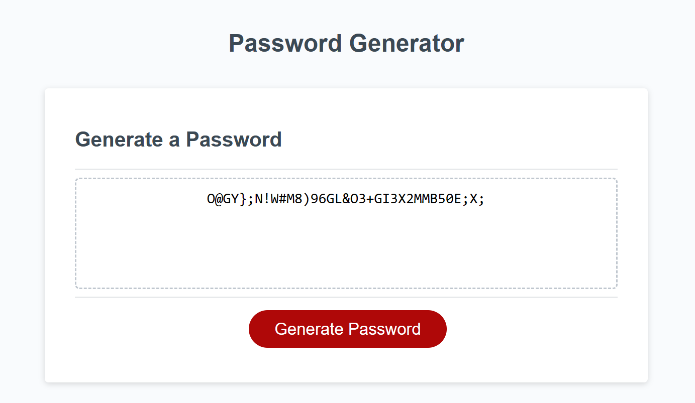

# Password-Generator

An application, which its main function is to generate random passwords with one click.

# Functionality:

- User must enter desired length for the password.
- User must select "OK" or "Cancel" on desired Uppercase/Lowercase letters, Numbers, or Special Characters.
- Based on user selection, a random password is then generated and displayed.

# Deployed Application

[link](https://ally27.github.io/Password-Generator/)
